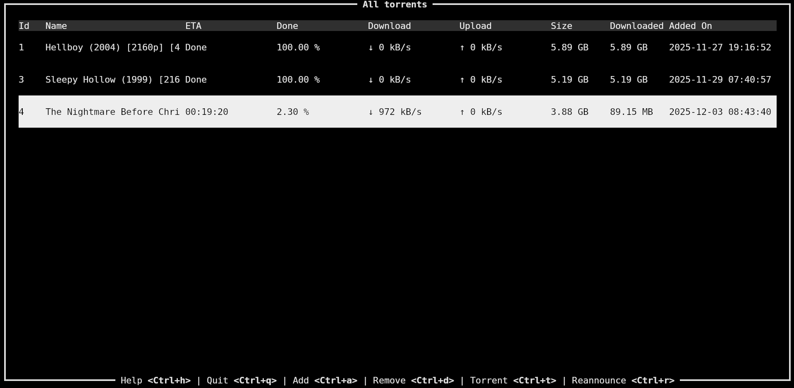

# About
A simple torrent TUI for Linux (tested only on Ubuntu 25.10).  
Uses [transmission-remote](https://transmissionbt.com) API and is written in Rust using Ratatui.
<br/>
<br/>
<br/>
# Built With
- [Rust](https://rust-lang.org/)
- [Ratatui](https://ratatui.rs/)
- [tui-scrollview](https://crates.io/crates/tui-scrollview)
- [tui-input](https://crates.io/crates/tui-input/0.14.0)
  <br/>
  <br/>
  <br/>
# Getting Started

## Prerequisites
1. Install Rust from [here](https://github.com/othneildrew/Best-README-Template?tab=readme-ov-file).
2. Install transmission from [here](https://transmissionbt.com/) or only the transmission-daemon using  
   `sudo apt-get install transmission-daemon`.
>    Proposed transmission configuration:  
>    ```shell
>    sudo systemctl stop transmission-daemon
>    sudo {my-editor} /etc/transmission-daemon/settings.json
>    ```
>     
>    - changing these directories might produce permission errors  
>        "download-dir": "{leave the default}",  
>        "incomplete-dir": "{leave the default}",
>    - disable authentication  
>        "rpc-authentication-required": false,
>    - disable host whitelist  
>        "rpc-host-whitelist-enabled": false,
>    - disable whitelist  
>        "rpc-whitelist-enabled": false,
>    - change the file creation mask, so that the downloaded files would be writeable by $USER  
>      "umask": 022 => "umask": 002
> 
>    ```shell
>    sudo systemctl start transmission-daemon
>    ```

## Installation
Release (pre-production): https://github.com/gmagk/rustor/releases/tag/1.0.0-alpha
<br/>
<br/>
<br/>
# Usage

## Key Bindings
| action                     | binding | steps                                                                              | comments                                                                                            |
|----------------------------|---------|------------------------------------------------------------------------------------|-----------------------------------------------------------------------------------------------------|
| show torrent info          | Ctrl+t  | From the 'torrent list' select with Up/Down keys a torrent and hit the key-binding |                                                                                                     |
| open torrent dir           | Ctrl+o  | From the 'torrent list' select with Up/Down keys a torrent and hit the key-binding | Should open up in the default file explorer.<br/>This only works on systems where xdg is installed. |
| add new torrent            | Ctrl+a  | From the 'torrent list' hit the key-binding                                        | Insert the full path of a local file which is of type *.torrent or copy-paste a magnet link.        |
| reannounce torrent         | Ctrl+r  | From the 'torrent list' select with Up/Down keys a torrent and hit the key-binding |                                                                                                     |
| remove torrent             | Ctrl+d  | From the 'torrent list' select with Up/Down keys a torrent and hit the key-binding | Does not delete the local file.                                                                     |
| home screen (torrent list) | Ctrl+b  |                                                                                    | Can be replaced with arg **--kb-home={my-char}**                                                   |
| help screen                | Ctrl+h  |                                                                                    | Can be replaced with arg **--kb-help={my-char}**                                                            |
| quit                       | Ctrl+q  |                                                                                    | Can be replaced with arg **--kb-quit={my-char}**                                                            |

## Customization
> For now can be used only with command arguments and only for the *quit* shortcut

| customization             | arg       | value type | comments                                  | example                                                                              |
|---------------------------|-----------|------------|-------------------------------------------|--------------------------------------------------------------------------------------|
| change *home* key binding | --kb-home | char       | no check is done for any conflicting keys | **--kb-home=x** (now can use *Ctrl+x* for *home* screen instead of default *Ctrl+b*) |
| change *help* key binding | --kb-help | char       | no check is done for any conflicting keys | **--kb-help=y** (now can use *Ctrl+y* for *help* screen instead of default *Ctrl+h*) |
| change *quit* key binding | --kb-quit | char       | no check is done for any conflicting keys | **--kb-quit=z** (now can use *Ctrl+z* to *quit* instead of default *Ctrl+q*)         |
> For convenience better add the whole command as an alias in the **.bashrc* file.
<br/>
<br/>
<br/>
# Contributing
Any contributions made will be **really appreciated**.  
Please open a new issue [here](https://github.com/gmagk/rustor/issues/new).

## License
Copyright (c) gman <tbuhtexis@yahoo.com>  
This project is licensed under the MIT license ([LICENSE](./LICENSE) or http://opensource.org/licenses/MIT)
