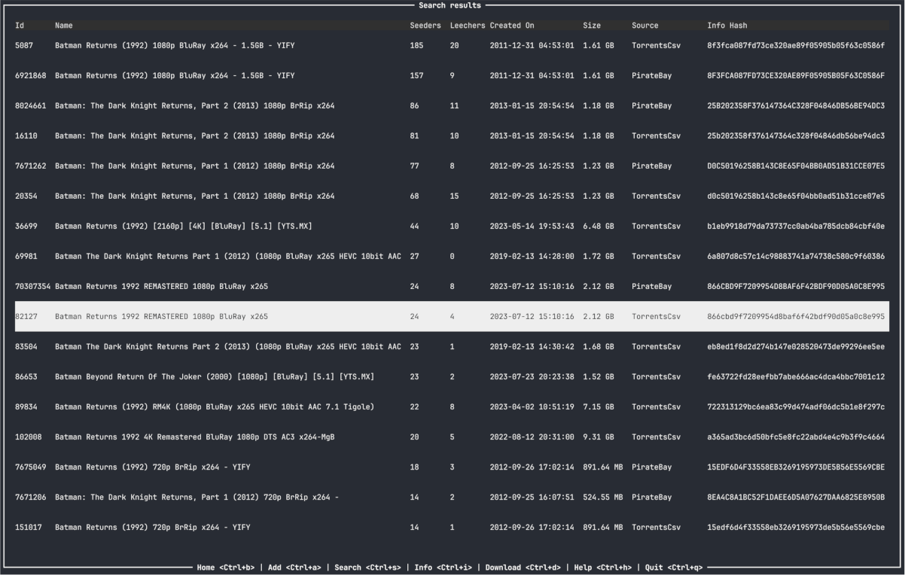
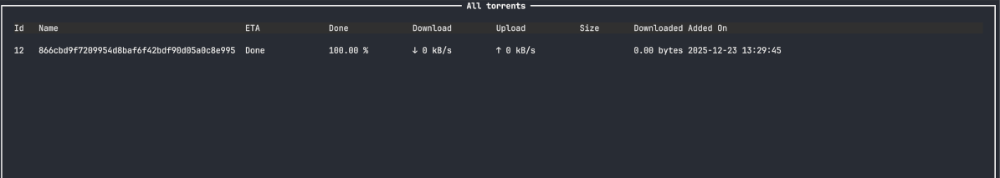
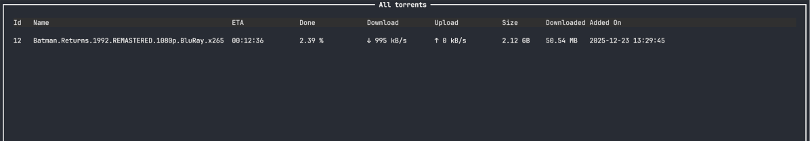
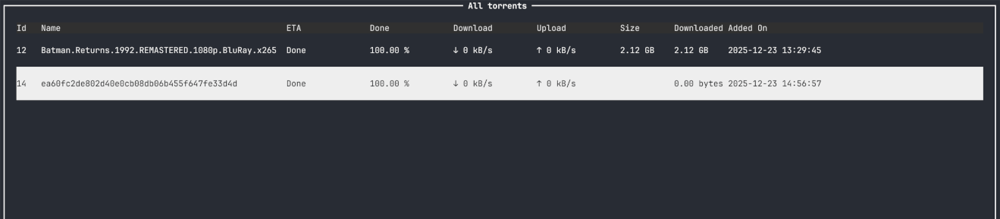
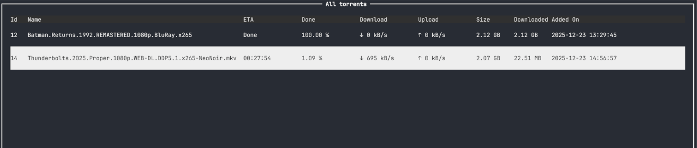

### Search for torrents
1. Search term

2. Search results

3. Pending download

4. Download started

---
### New torrent from local-file or magnet-link
1. Add torrent

2. Pending download

3. Download started

---

# About
A simple torrent TUI for Linux (tested only on Ubuntu 25.10).  
Uses [transmission-remote](https://transmissionbt.com) API and is written in Rust using Ratatui.

# Built With
- [Rust](https://rust-lang.org/)
- [Ratatui](https://ratatui.rs/)
- [tui-scrollview](https://crates.io/crates/tui-scrollview)
- [tui-input](https://crates.io/crates/tui-input/0.14.0)

# Getting Started

## Prerequisites
1. Install Rust from [here](https://github.com/othneildrew/Best-README-Template?tab=readme-ov-file).
2. Install transmission from [here](https://transmissionbt.com/) or only the transmission-daemon using  
   `sudo apt-get install transmission-daemon`.
>    Proposed transmission configuration:  
>    ```shell
>    sudo systemctl stop transmission-daemon
>    sudo {my-editor} /etc/transmission-daemon/settings.json
>    ```
>     
>    - changing these directories might produce permission errors  
>        "download-dir": "{leave the default}",  
>        "incomplete-dir": "{leave the default}",
>    - disable authentication  
>        "rpc-authentication-required": false,
>    - disable host whitelist  
>        "rpc-host-whitelist-enabled": false,
>    - disable whitelist  
>        "rpc-whitelist-enabled": false,
>    - change the file creation mask, so that the downloaded files would be writeable by $USER  
>      "umask": 022 => "umask": 002
> 
>    ```shell
>    sudo systemctl start transmission-daemon
>    ```

## Installation
Release (pre-production): https://github.com/gmagk/rustube/releases/tag/1.0.0-alpha

## Configuration

#### Configuration file (.toml)
- **No** file _(config file is not required, at least for the current version)_
- **Default** location `$HOME/.rustor/config.toml`
- **Custom** location using the cli argument `--config-file </path/to/file>`  
  _(for convenience better add the whole command as an alias in the **.bashrc* file)_.  
  Once a custom config file is provided it should contain (even empty) the following structure:  
  ```toml
  [key_bindings]
  ```
  > All key-bindings which can be configured need the **Ctrl** prefix in order to be used.  
  > _(no check is done for any conflicting keys)_
  > 
  Example of custom config file:
  ```toml
  [key_bindings]
  KbHome = "p" # Now `Ctrl+p` will navigate to Home screen
  ```

<br/>

#### Default key-bindings
| key        | value | description                                           |
|------------|-------|-------------------------------------------------------|
| KbAdd      | "a"   | add new torrent                                       |
| KbDel      | "d"   | remove selected torrent in __Home__                   |
| KbDownload | "d"   | download selected torrent screen in __Search Results__ |
| KbInfo     | "i"   | show info for torrent in __Home__ or __Search Results__ |
| KbHelp     | "h"   | go to __Help__                                        |
| KbHome     | "b"   | go to __Home__                                        |
| KbQuit     | "q"   | quit                                                  |
| KbReAnn    | "r"   | reannounce torrent in __Home__                        |
| KbSearch   | "s"   | search for torrents                                   |

<br/>

#### Navigation keys
| key       | description |
|-----------|-------------|
| "j"       | down        |
| "k"       | up          |
| "&#8595;" | down        |
| "&#8593;" | up          |


# Contributing
Any contributions made will be **really appreciated**.  
Please open a new issue [here](https://github.com/gmagk/rustor/issues/new).

# License
Copyright (c) gman <tbuhtexis@yahoo.com>  
This project is licensed under the MIT license ([LICENSE](./LICENSE) or http://opensource.org/licenses/MIT)
